# Chandni Traders

Domain specification for the storefront, checkout, chat, loyalty, orders, and admin console. Use during development and full-site audits.

---

## Documentation

| Document | Purpose |
| -------- | ------- |
| [Setup & onboarding](docs/setup.md) | Install, env vars, local dev, troubleshooting |
| [Go-live runbook](docs/go-live.md) | Production deploy, integrations, smoke test, launch checklist |
| [Architecture](docs/architecture.md) | Monorepo layout, apps, packages, MongoDB, security boundaries |
| [Catalog operations](docs/catalog.md) | Products, attributes, pools, variants in Admin |
| [Website audit guide](docs/website-audit.md) | Checklist for auditing storefront + admin |
| [Engineering handbook](docs/engineering-handbook.md) | Project standards, optimizations inventory, vibeCodingRules gaps, new-dev rules |

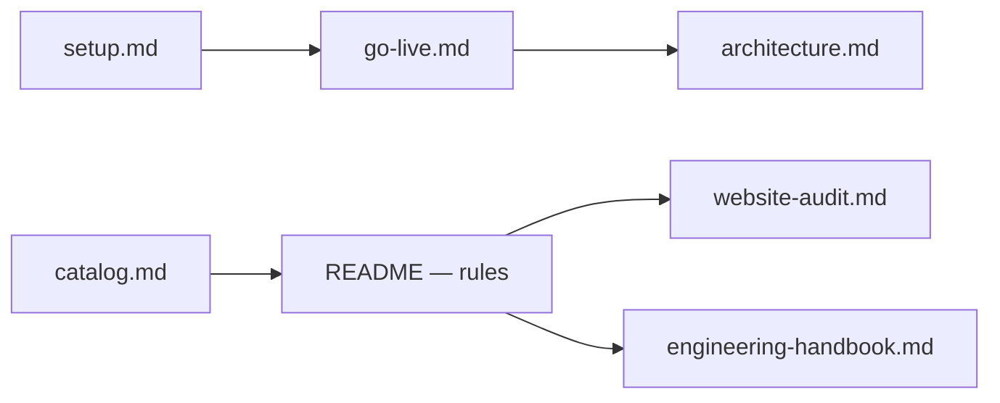

**Apps:** Storefront `@store/web` (port 3000) · Admin `@store/admin` (port 3001) · Packages `@store/db`, `@store/shared`, `@store/ui`.

---

## 1. Catalog & domain rules

### Data source

- **MongoDB** is the catalog source of truth — categories, attributes, brands, products, variants.
- **Admin CRUD** or database restore; no bundled seed data in the repo.
- **Orders are snapshots** — each line stores `productName`, `variantSummary`, `unitPriceRupees` at placement.

### Attribute model

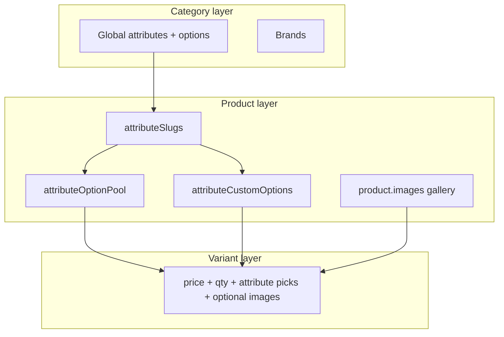

| Layer | Where | Purpose |
| ----- | ----- | ------- |
| **Category attribute** | `attributes` collection | Shared dimensions (Storage, Color, PTA, …) with `options[]` for filters and labels. |
| **Product config** | `attributeSlugs`, pools, custom options, defaults | Which dimensions apply; whitelisted values; product-only values. |
| **Variant row** | `products.variants[]` | SKU: `priceRupees`, `quantity`, `forceOutOfStock`, `warrantyDays`, `attributes`, optional `images[]`. |

**Rule:** Variant values must sit in the product pool. Duplicate attribute combinations on one product are rejected.

### Visibility cascade

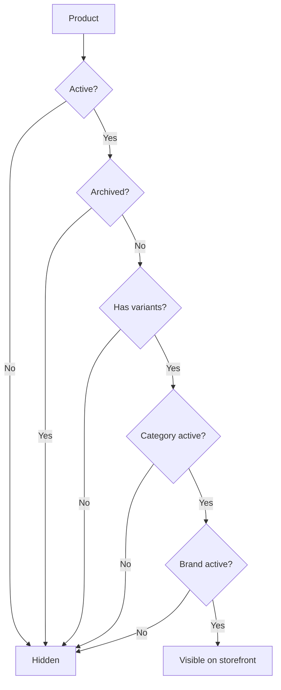

### Core entities

| Entity | Key rules |
| ------ | --------- |
| **Category** | Slug, marketing content, SEO. Inactive → all products hidden. |
| **Brand** | Per-category scope. Product form filters brands by category. |
| **Attribute** | Filter visibility (always / by brand); card position on listings. |
| **Product** | Up to **8** shared images; `isActive`, `isArchived`, `isFeatured`. |
| **Variant** | Optional per-variant `images[]` (falls back to product gallery); in stock when `quantity > 0` and not `forceOutOfStock`. Stock reserved at order placement. |

---

## 2. Storefront shell & navigation

### Layout map

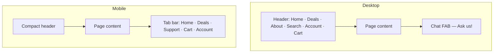

| Surface | Behavior |
| ------- | -------- |
| **Desktop header** | Home, Deals, About, Search overlay, Account/Sign in, Cart dropdown. |
| **Mobile tab bar** | Home, Deals, **Support** (chat), Cart, Account. |
| **Chat** | On **every** storefront page when enabled — desktop FAB + mobile Support tab. Disabled → WhatsApp. |
| **Notice banner** | Optional; dismissible per session (Settings → Notices). |
| **Chat / search load** | Deferred after idle (~1.5s) to reduce initial blocking. |

### Route map

| Route | Behavior |
| ----- | -------- |
| `/` | No `?q=` → image-led homepage banner + category tiles. `/?q=` → global search (24/page, max 100 chars). |
| `/{category}` | Listing + URL filters. Inactive → coming soon. |
| `/{category}/{slug}` | PDP; wrong category in URL → canonical redirect. |
| `/deals` | Catalog deal pills + checkout offer chips + product grid. |
| `/cart` | Full-page cart (browser storage). |
| `/checkout` | Guests can view; **place order requires sign-in**. |
| `/checkout/success?order=` | Confirmation — auth required. |
| `/about` | Marketing — hero, categories, process, visit store. |
| `/account/*` | Protected except `/account/sign-in`. |

Reserved segments (not categories): `about`, `account`, `api`, `cart`, `checkout`, `deals`.

---

## 3. Search, shop & deals

### Search overlay flow

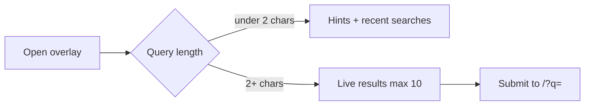

| Rule | Value |
| ---- | ----- |
| Debounce | ~220ms |
| Recent searches | 5 in browser storage |
| API rate | 60/min/IP |
| Search backend | Atlas Search when index exists; regex fallback otherwise |

### Category listing

| Filter (AND) | URL param |
| ------------ | --------- |
| Brand | `brand` |
| Price | `min`, `max` |
| In stock only | `stock=1` |
| Sort | `sort` |
| Text | `q` |
| Attributes | `attr.{slug}` |

**Pagination:** 24/page (max 60); infinite scroll + load-more fallback.

### Deals surfaces

```mermaid
flowchart LR
  CD[Catalog deal] --> DEALS[/deals pills]
  CD --> CARD[Card badge]
  CD --> PDP[PDP pill + auto-apply]
  CO[Checkout offer] --> CHIPS[Deals header chips]
  CO --> CART[Cart + checkout]
```

---

## 4. Product detail (PDP)

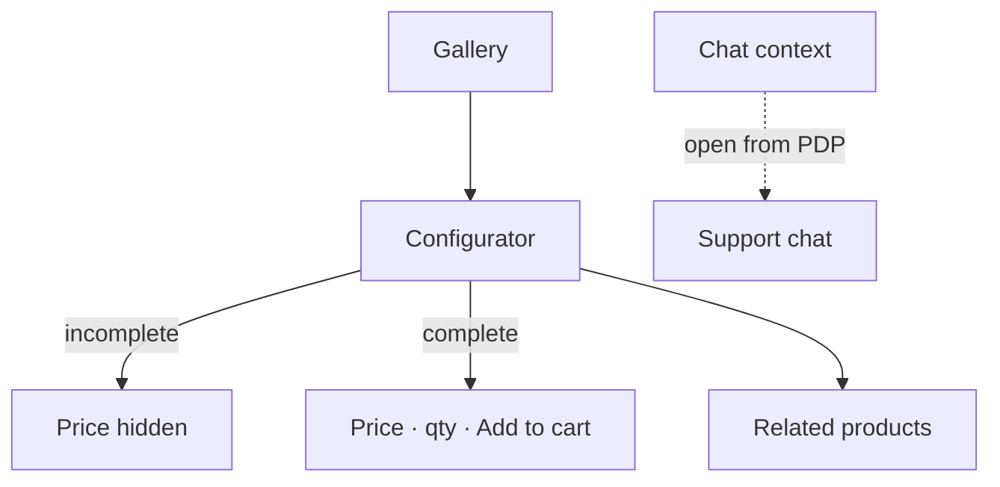

| Feature | Rule |
| ------- | ---- |
| URL sync | Attribute slugs only; invalid combos reset client-side. |
| Gallery | Variant `images[]` when set; otherwise product gallery. |
| Qty cap | min(stock − cart qty, **10**/line). |
| Catalog deals | Badge on gallery + guidance pill; checkout offers never on PDP. |
| Closest match | Nearest stocked variant + WhatsApp when exact combo missing. |
| Related | Same category + brand — show **4** from pool of **8**. |

---

## 5. Cart & checkout

### Checkout journey

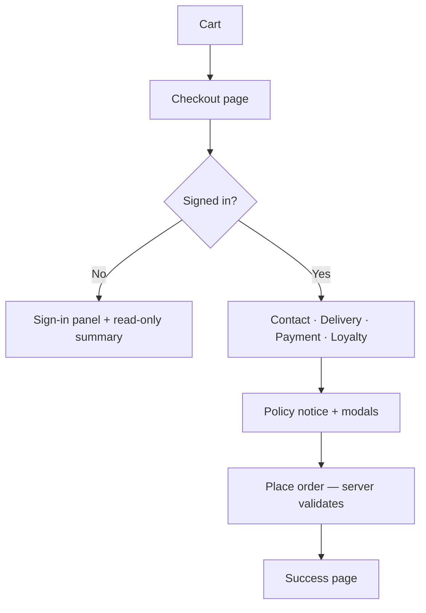

### Price calculation (server only)

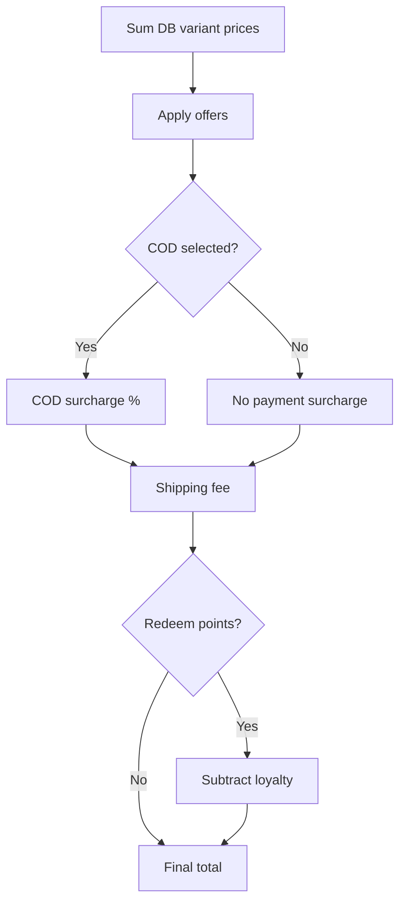

### Cart limits

| Rule | Value |
| ---- | ----- |
| Max lines | 20 product+variant pairs |
| Max qty / line | 10 (or stock cap) |
| Storage | Browser localStorage; cross-tab sync |
| Catalog offers | Locked on line at add-to-cart |

### Checkout steps

| Step | Rules |
| ---- | ----- |
| **Contact** | Name min 2 chars; phone read-only from account. |
| **Delivery** | **Pickup** — free. **Courier** — flat fee (default **Rs 1,500**, admin-configurable) unless subtotal **after offers** ≥ threshold (default **Rs 50,000**) → free, or a checkout offer grants free shipping. Address min 2 chars for courier. |
| **Payment** | **Bank transfer**, **cash on delivery**, or **pay online** (optional). Admin toggles each method. **Bank transfer (default):** transfer online → send payment screenshot on WhatsApp → admin confirms. **COD:** order confirms immediately; pay cash on delivery. **Pay online:** PayFast or Rapid Gateway when enabled under Integrations (admin picks one). **COD surcharge:** admin % on merchandise subtotal after offers. Optional chip notes per method. |
| **Loyalty** | Min **100** pts; max **20%** of subtotal; 1 pt = Rs 1. Blocked when checkout offer disallows points. |
| **Policies** | Placing order agrees to return + privacy policies. Links open **modals** with admin HTML — no checkbox. |
| **Placement** | Idempotency key **required**; max **5** orders / **15 min**; atomic stock reservation; server re-prices every line from DB. |

### Checkout security (server authority)

| Rule | Behavior |
| ---- | -------- |
| **Pricing** | Totals computed only on server from live variant prices — client cart amounts are never trusted. |
| **Offers** | Only active + eligible offers apply; discount capped at subtotal; catalog line offer must match server lock; usage reserved atomically before order create (rolled back on failure). |
| **Idempotency** | `idempotencyKey` required on `POST /api/orders` — duplicate parallel submits return the same order. |
| **Stock** | Reserved at placement; released on cancel / refund / return paths. |
| **Payments** | PayFast hash verified with constant-time compare; Rapid webhook signature checked; paid amount required to auto-confirm card orders. |
| **Rate limits** | Checkout, cancel, OTP, chat, and public catalog APIs rate-limited per IP + identifier. |

### Payment methods (checkout)

| Method | ID | Notes |
| ------ | -- | ----- |
| Bank transfer | `bank-transfer` | Toggle: `paymentBankTransferEnabled` (default on). Enter bank name + account number or IBAN in **Settings → Payments** — chip hidden and API blocked until details exist. Order stays **`pending-payment`** until admin confirms after WhatsApp screenshot. |
| Cash on delivery | `cod` | Toggle: `paymentCodEnabled`; surcharge: `codSurchargePercent`. Order status **`confirmed`** on placement; pay cash when the parcel arrives. |
| Pay online | `card` | Toggle: `paymentCardEnabled` (default off). **PayFast** or **Rapid Gateway** — admin picks active provider in **Settings → Integrations**. Auto-confirms via webhook or PayFast return callback. |

---

## 6. Authentication & account

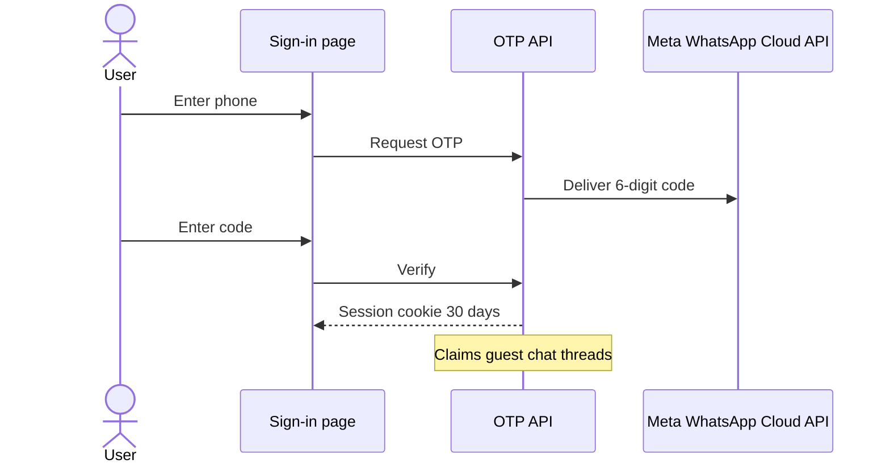

| Rule | Value |
| ---- | ----- |
| Identity | Phone only; no passwords |
| OTP | 6 digits; **5 min** TTL; **5** max wrong guesses |
| Rate limits | **5** issues / **15 min**; **10** verifies / **15 min** |
| Resend | **1 min** throttle; UI cooldown **30s** |
| Fallback | Dev: codes in server log when Meta WhatsApp env unset |
| Addresses | Max **6**; cannot delete last |
| Sign-out | Clears session, guest chat cookies, cart |

### Account pages

| Page | Content |
| ---- | ------- |
| `/account` | Stats, order filters, loyalty card |
| `/account/profile` | Name, city, addresses |
| `/account/orders/[id]` | Timeline, items, payment, loyalty, **cancel** while `pending-payment` or `confirmed` |

---

## 7. Chat & AI assistant

### Entry & availability

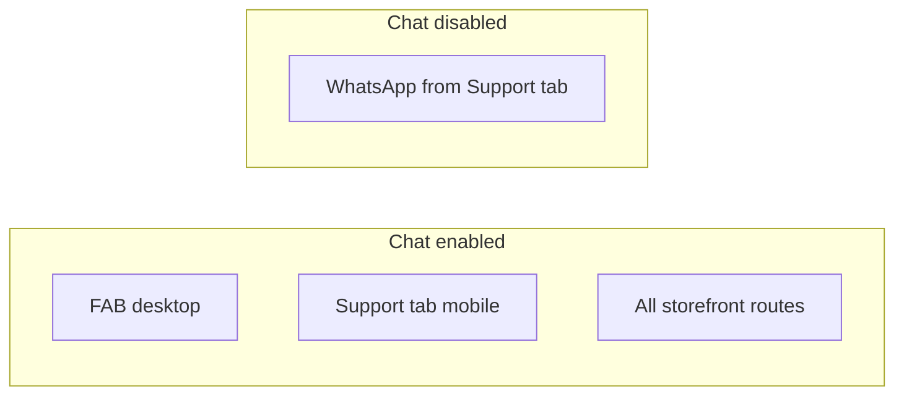

| Rule | Default |
| ---- | ------- |
| Guest messages | **5** → sign-in gate |
| Polling | **5s** focused / **30s** blurred |
| Message max | **4,000** chars |
| Anonymous cookie | **90** days |
| Nudge delay | **7** min idle (dismissible) |

### Bot pause states

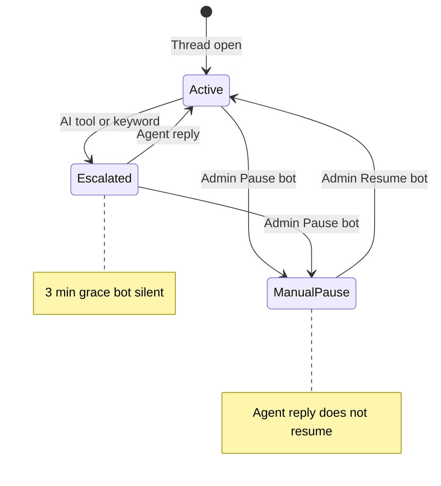

| Pause type | Trigger | Cleared by |
| ---------- | ------- | ---------- |
| **Escalation** | `escalate_to_human` tool or keywords (`speak to`, `manager`, …) | Agent reply (unless manual pause set) |
| **Manual** | Admin **Pause bot** | Admin **Resume bot** only |

### Customer UI when paused

| Element | Behavior |
| ------- | -------- |
| Banner | Highlighted — team reviewing; can still message |
| Subtitle | “Team is reviewing — you can still message us” |
| Footer | Reminder that a teammate will follow up |
| Typing indicator | Hidden while paused |

### Admin inquiries UI when paused

| Location | Shows |
| -------- | ----- |
| Sidebar row | Alert border + icon; **Bot off** or **Escalated** badge |
| Header | Badge + Pause / Resume bot |
| Below header | Why / when / who paused |
| Above composer | **Bot status: Paused** bar |

### Assistant capabilities

- Auto-reply when enabled and thread not paused.
- Pacing: read phase → typing phase with character-based delays.
- Tools: catalog search, stock, deals, session-scoped orders/loyalty.
- PDP context passed when chat opened from product page.

---

## 8. Loyalty & offers

### Offer types

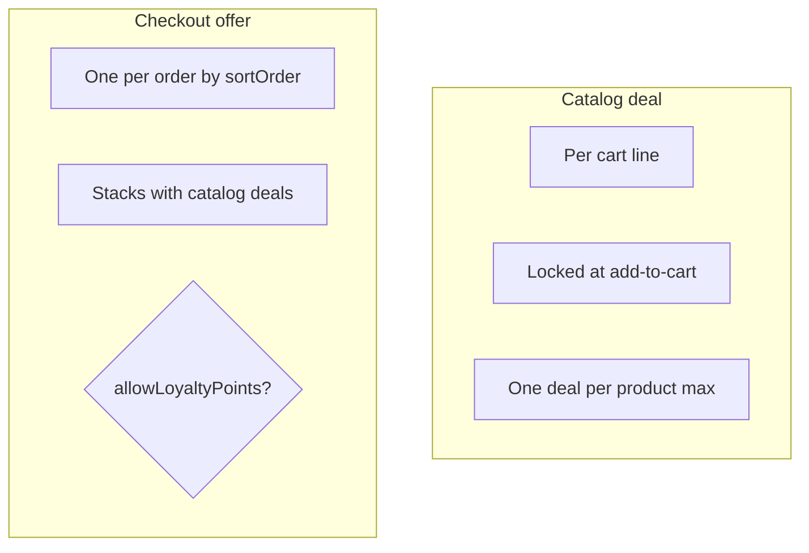

| Type | Surfaces | Evaluation |
| ---- | -------- | ------------ |
| **Catalog deal** | `/deals`, cards, PDP | Per line; cart-total/payment rules ignored on display |
| **Checkout offer** | Deals chips, cart, checkout | Cart total / payment method; may block loyalty |
| **COD surcharge** | Checkout only | Admin % — not an offer |

**Actions:** percentage discount, fixed Rs off, free shipping.

**Conditions:** product, category, brand, attribute, price range, cart total, min line qty, payment method.

### Loyalty

| Rule | Default |
| ---- | ------- |
| Earn | `loyaltyEarnPercent` of **payable order total** (after offers, COD fee, delivery, minus redemption) |
| Credit | On status → `delivered` |
| Reversal (earned) | On `cancelled` / `refunded` after delivered — not on `returned` |
| Redeem refund | On `cancelled` / `refunded` / `returned` — points debited at checkout are credited back |
| Redeem | Min **100** pts; max **20%** of subtotal **after offers**; 1 pt = Rs 1 |
| **Balance at checkout** | `POST /api/loyalty-balance` requires a signed-in customer session; returns only the authenticated customer's balance (no phone lookup) |

---

## 9. Order lifecycle

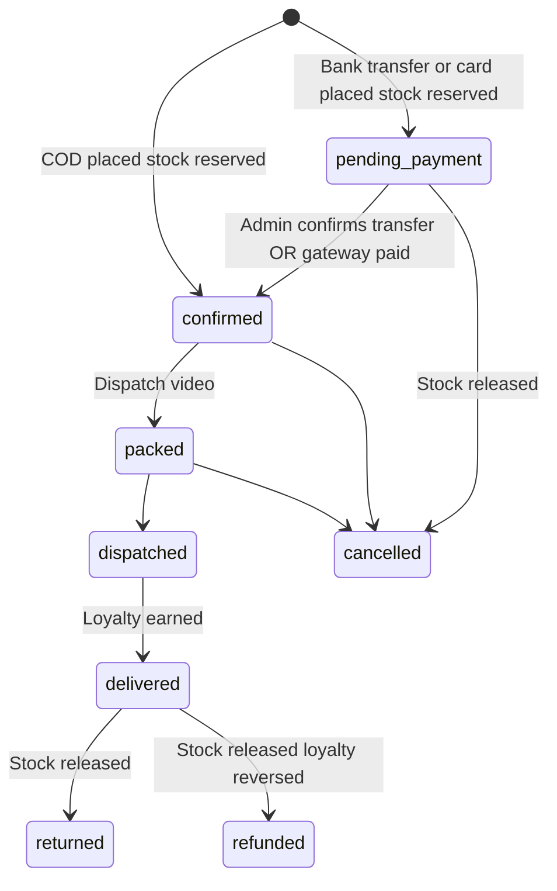

| Status | Admin / system behavior |
| ------ | ----------------------- |
| `pending-payment` | **Bank transfer or pay online** — awaiting WhatsApp screenshot (bank) or gateway payment; editable lines, address, payment, delivery |
| `confirmed` | **COD lands here on place**; bank transfer after admin confirms; pay online after PayFast/Rapid confirms. Locked from line edits; fulfillment moves **one step at a time** (no skip to `delivered`) |
| `packed` | Requires `dispatchVideoUrl` |
| `dispatched` | No backward step on happy path |
| `returned` | Only from `delivered` |
| `delivered` | Credits loyalty |
| `cancelled` / `refunded` / `returned` | Stock released; earned loyalty reversed on refund after delivered; redeemed points refunded |
| **Customer cancel** | Account order detail → **Cancel order** while `pending-payment` or `confirmed` (releases stock, refunds redeemed points) |
| **Admin bank-transfer panel** | Pending bank-transfer orders show store account details on admin order detail for screenshot matching |

Staff and customer alerts fire **after** successful writes (non-blocking — failure never blocks the order or chat reply).

### Staff recipients

| Channel | Recipients |
| ------- | ---------- |
| **Email** | Every active admin `users` row with email + `staffNotifyEmail` (Integrations) + store support email |
| **WhatsApp** | `staffNotifyWhatsApp` (Integrations) + phone on every active admin user (shop events); inquiries also notify assignee phone when set |

### Customer WhatsApp

Requires customer phone on order snapshot or inquiry thread + `whatsappCustomerOrderTemplate` in Integrations.

### Event matrix

| Event | Staff email | Staff WhatsApp | Customer WhatsApp |
| ----- | :---------: | :------------: | :---------------: |
| Order placed | Yes | Yes | Yes |
| Order status changed | Yes | Yes | Yes |
| Payment confirmed (gateway or admin) | Yes | Yes | Yes |
| Order cancelled | Yes | Yes | Yes |
| Customer chat message | Yes | Yes (global + assignee) | — |
| Inquiry escalated (AI / keywords) | Yes | Yes (global + assignee) | — |
| Agent reply | — | — | Yes |

**Limit:** Low-stock variants surface in Admin dashboard + bell only — no email/WhatsApp for inventory thresholds today.

**Config:** Admin → Settings → Integrations (Resend, Meta WhatsApp, template names). Shop Health warns when any channel is misconfigured.

---

## 9b. Storefront performance & motion

| Layer | Behavior |
| ----- | -------- |
| **ISR** | Hot pages revalidate every **30s**; router stale cache tuned for snappy back/forward. |
| **Boot warm** | On server start: Mongo connect + storefront read caches (settings, categories, attributes). |
| **Prefetch** | Idle prefetch of home, deals, about, cart, and top category routes. |
| **Images** | Next.js optimizer — AVIF/WebP; long cache TTL on product photos. |
| **Deferred UI** | Chat widget + search overlay load after ~**1.5s** idle to protect first paint. |
| **Motion** | Scroll reveals (`.reveal`), navigation progress bar, route cross-fade — **not removed** for performance; `prefers-reduced-motion` shortens/disables animation only. |
| **Build resilience** | Store settings, SEO metadata, chat settings, and layout reference data fall back to defaults when Mongo is unreachable at build or boot — pages still render; ISR refreshes on next request. |

---

## 10. Admin console

### Workspace map

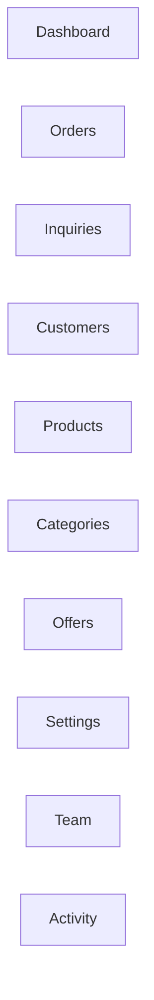

| Workspace | Permission (typical) | Key actions |
| --------- | -------------------- | ----------- |
| **Orders** | `order_view` / `order_update` | Stepper, edits while pending-payment, cancel, invoice |
| **Inquiries** | `inquiry_view` / `inquiry_reply` | Reply, attach, **pause/resume bot**, assign |
| **Customers** | `customer_view` | Profile, loyalty, sign-in code |
| **Products** | `product_*` | Wizard, variants, SEO |
| **Categories** | `category_manage` | Categories, brands, attributes |
| **Offers** | `offer_manage` | Banner, rules, publish |
| **Settings** | `settings_view` | See §11 |
| **Team** | `team_view` | Roles, invites |
| **Activity** | `activity_view` | Audit log |

### Roles

| Role | Access |
| ---- | ------ |
| **Owner** | Full; `order_delete` + `data_cleanup` |
| **Business manager** | Catalog, orders, customers, chat, settings |
| **Product manager** | Catalog CRUD + media |
| **Marketing manager** | Offers, categories, brands |
| **Support staff** | Read ops data; inquiry reply |

Super-admin bypasses all permission checks.

**Sign-in:** Email + password on `/login`. Password fields include show/hide toggle (login, account, team invite/reset, API key fields in chat settings).

---

## 11. Admin settings

| Tab | Configures |
| --- | ---------- |
| **Site URLs** | `publicSiteUrl` |
| **Store details** | Name, tagline, logos, favicons |
| **Contact** | Phones, email, WhatsApp, address, hours |
| **Payments** | Card/COD toggles, COD %, chip notes |
| **Delivery** | Free-delivery threshold + courier flat fee |
| **Notices** | Global delivery note, site banner |
| **Policies** | Moneyback days, warranty months, return/privacy HTML → checkout modals |
| **Loyalty** | Earn % on delivered orders |
| **Inventory** | Low-stock threshold → dashboard + bell |
| **SEO** | Global meta, OG, Organization JSON-LD (wired on storefront) |
| **Chat** | Widget, guest limit, assistant, **all provider API keys**, real-time transport, nudge |
| **Integrations** | Social links, pixels, **PayFast / Rapid Gateway**, **Meta WhatsApp OTP**, Resend, staff/customer WhatsApp templates, **media storage status** |
| **Data cleanup** | Owner-only bulk delete |

**Alerts bell:** unread inquiries + pending payments + low-stock (permission-scoped).

---

## 12. Limits reference

| Area | Limit |
| ---- | ----- |
| Cart lines | 20 |
| Cart qty / line | 10 |
| Courier delivery | Rs 1,500; free above threshold |
| Payment methods | Bank transfer, pay online, COD (admin toggles) |
| OTP | 6 digits / 5 min / 5 fails |
| Guest chat messages | 5 |
| Loyalty redeem | 100 min; 20% max subtotal |
| Orders placed | 5 / 15 min per customer |
| Search query | 100 chars |
| Products / page | 24 (max 60) |
| Admin login attempts | 8 / 15 min |
