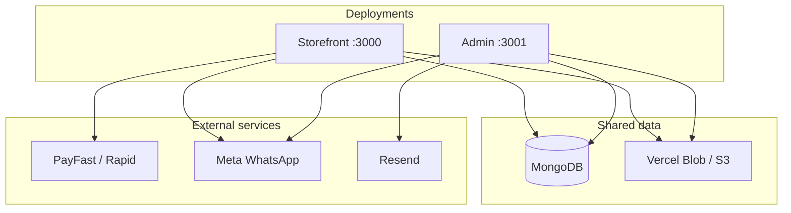
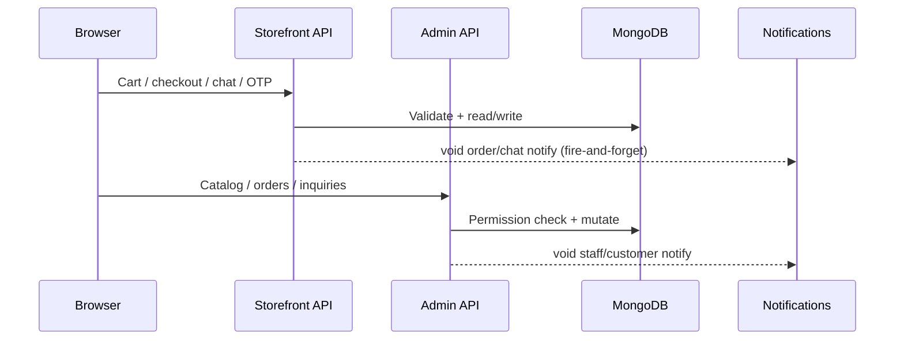
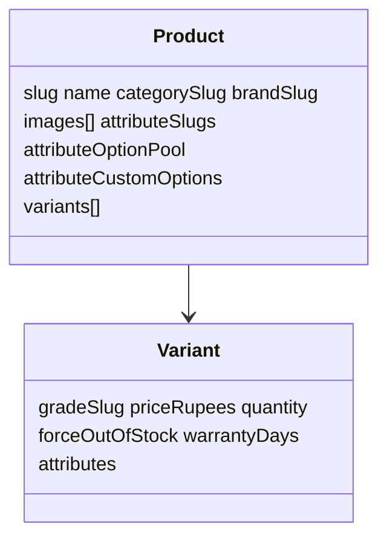
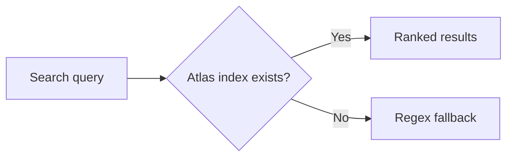

# Architecture

Technical map of the Chandni Traders monorepo — apps, packages, MongoDB, security boundaries, and performance.

---

## Stack

| Layer | Choice |
| ----- | ------ |
| Runtime | Node.js 22+ |
| Monorepo | npm workspaces + Turborepo |
| Framework | Next.js 16 (App Router), React 19 |
| Database | MongoDB via Mongoose (`packages/db`) |
| Auth | Auth.js — separate sessions for customers and admin |
| Storage | Vercel Blob or S3 (`STORAGE_PROVIDER`) |
| Styling | Tailwind CSS 4 |
| Customer OTP | Meta WhatsApp Cloud API (Business account) |
| Online payments | PayFast or Rapid Gateway (admin picks one active provider) |
| Staff alerts | Resend email to all active team members + Meta WhatsApp (orders, chat, escalation) |
| Customer order updates | Meta WhatsApp utility template (placed, status, payment, agent replies) |
| AI chat | OpenAI, Google Gemini, or Anthropic (optional; DB or env keys) |

---

## Applications

| App | Package | Dev port | Role |
| --- | ------- | -------- | ---- |
| Storefront | `@store/web` | 3000 | Shop, cart, checkout, account, chat |
| Admin | `@store/admin` | 3001 | Catalog, orders, customers, offers, settings |

Both share one MongoDB database and one Blob store.



---

## Packages

| Package | Purpose |
| ------- | ------- |
| `@store/db` | Models, connection, inventory, order numbers, staff notify contacts, atomic order/offer transitions |
| `@store/shared` | Client-safe domain logic — pricing, offers, attributes, chat, validation, formatters |
| `@store/shared/server` | **Server-only** — notifications (email/WhatsApp), `assertServerEnv`, `resolveStorageProvider` (imports `@store/db`) |
| `@store/ui` | Buttons, selects, quantity stepper |

**Import rule:** Client components and shared UI **must not** import `@store/shared/server` or anything that pulls Mongo into the browser bundle. Server route handlers and `packages/db` use `@store/shared/server` for outbound notifications.

Apps import from package barrels — avoid deep internal paths unless splitting client/server boundaries.

---

## Request flow



| App | API location | Rules |
| --- | ------------ | ----- |
| Storefront | `apps/web/src/app/api/` | Prices + stock re-validated at order placement; idempotency key required |
| Admin | `apps/admin/src/app/api/` | Permission per handler; activity log non-blocking |

**Serializers** per app — different DTO shapes for the same Mongo documents.

### Storefront API handler sequence (mutations)

1. Rate limit (public endpoints)
2. Authenticate customer (when required)
3. Parse + validate body (shared Zod-style validators)
4. Execute business logic + DB (atomic where status/stock/offers change)
5. Fire-and-forget notifications (`void` — never block response)
6. Respond with safe DTO

### Admin API handler sequence

1. `requireSession` / `getVerifiedSession`
2. `hasPermission` for action
3. Parse + validate
4. Execute + DB
5. Side effects (activity log, notifications) — non-blocking
6. Respond

---

## Security boundaries

| Concern | Implementation |
| ------- | -------------- |
| Checkout pricing | Server-only; offers filtered by eligibility + schedule; `incrementOfferUsageCounts` atomic |
| Payment webhooks | Signature/hash verification; PayFast uses constant-time compare |
| Order status races | `claimOrderStatusTransition` — conditional updates |
| Admin sessions | JWT includes `passwordChangedAtMs`; invalidated on reset |
| Settings writes | Allowlisted keys per route (e.g. SEO fields scoped) |
| Storefront headers | CSP, HSTS (prod), `X-Frame-Options: DENY`, `nosniff` |
| Rate limiting | In-memory token bucket (`@store/shared/rateLimit`) — swap for Redis at scale |

---

## Performance (storefront)

| Mechanism | Location | Effect |
| --------- | -------- | ------ |
| ISR `revalidate = 30` | Hot routes | Fresh catalog without per-hit DB on every view |
| `warmStorefrontReadCaches()` | `instrumentation.ts` → `cached.ts` | Settings/categories/grades/attributes warm after Mongo connect |
| `generateStaticParams` | Category pages | Prebuild active category slugs |
| `IdleRoutePrefetch` | `AppShell` | Prefetch likely next routes after idle |
| Image optimizer | `next.config` | AVIF/WebP + 7-day optimizer cache |
| Motion | `RevealRoot`, `NavigationProgress`, `RouteTransition` | UX polish — separate from data caching |

---

## Notifications architecture

```mermaid
flowchart LR
  subgraph triggers [Triggers]
    OP[Order place/status/payment/cancel]
    CH[Customer chat message]
    ES[Inquiry escalation]
    AR[Agent reply]
  end
  subgraph dbpkg [packages/db]
    FIRE[fireOrderEventNotifications]
    TARGETS[staffNotifyContacts]
  end
  subgraph sharedsrv [@store/shared/server]
    OEN[orderEventNotify]
    ISN[inquiryStaffNotify]
    STAFF[staffAlertDispatch]
    RS[resendEmail]
    WA[whatsappCloudApi]
  end
  OP --> FIRE --> OEN --> STAFF
  CH --> ISN --> STAFF
  ES --> ISN
  AR --> ISN
  STAFF --> RS
  STAFF --> WA
  FIRE --> TARGETS
```

Configuration merges **Integrations** document (Mongo) with env fallbacks. Shop Health (`apps/admin/src/lib/server/shopHealth.ts`) reads the same sources.

---

## MongoDB collections

| Collection | Domain |
| ---------- | ------ |
| `categories` | Catalog groupings |
| `brands` | Brands per category |
| `grades` | Condition tiers |
| `attributes` | Filter/config dimensions |
| `products` | Listings + embedded `variants[]` |
| `offers` | Promotional rules + usage counters |
| `orders` | Checkout snapshots + status + idempotency key |
| `customers` | Phone identity, addresses |
| `loyaltyaccounts` | Balances + ledger |
| `inquiries` | Chat threads + bot pause fields |
| `users` | Admin accounts |
| `settings` | Store configuration |
| `otpcodes` | Customer sign-in codes |
| `activityentries` | Admin audit log |

### Product document



### Inquiry chat fields

| Field | Purpose |
| ----- | ------- |
| `assistantMuted` | Bot paused on thread |
| `assistantMuteReason` | `escalation` or `manual` |
| `assistantMutedAt` | When paused |
| `assistantMutedByUserId` | Admin who paused (manual) |
| `escalatedAt` | Escalation timestamp |

---

## Search



- Shop filters: compound indexes on `products`.
- Atlas index created in Atlas UI (`products_search` by default).

---

## What is not in this repo

| Item | Note |
| ---- | ---- |
| Seed scripts | Catalog via Admin |
| Standalone API server | Next.js route handlers |
| Job queue / Redis | Inline side effects; rate limits in-process |
| Low-stock email/WhatsApp | Dashboard + bell only |

---

## Related docs

- [README](../README.md) — business rules
- [go-live.md](go-live.md) — production launch
- [website-audit.md](website-audit.md) — audit checklist
- [setup.md](setup.md) — install

