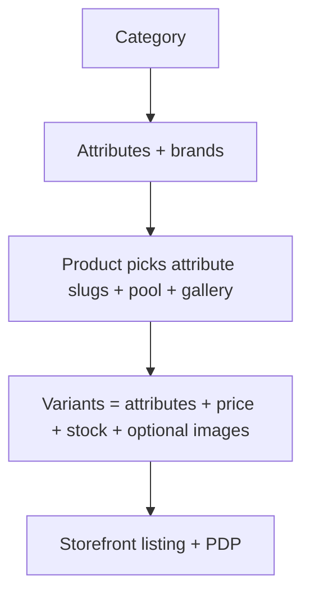
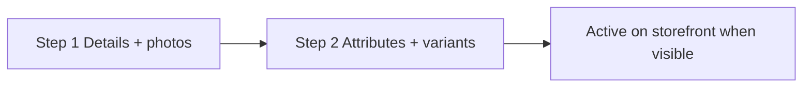
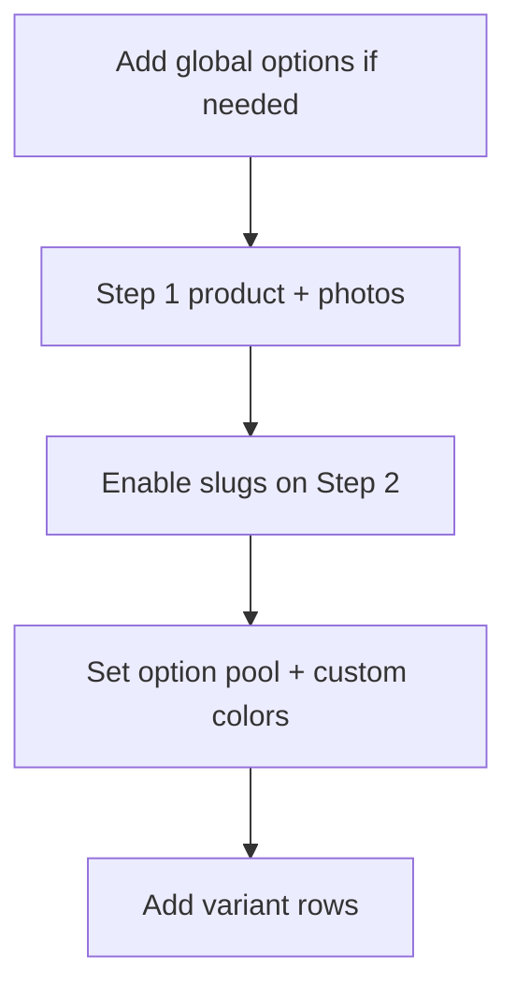
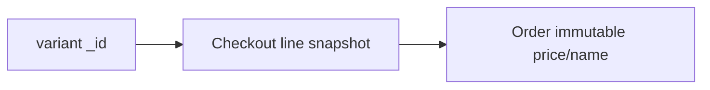

# Catalog operations

How products, attributes, pools, and variants work in Admin.

---

## Mental model

Shoppers only see products that pass the [visibility cascade](../README.md#1-catalog--domain-rules) and variants matching PDP selections.

---

## Global attributes

Create under each category — e.g. `storage`, `color`, `pta-status`, `ram`.

| Field | Purpose |
| ----- | ------- |
| **Options** | Template values + labels (e.g. `128gb` / `128 GB`) |
| **Visibility** | Shop filters: always or by brand |
| **Card position** | Product card display: overlay, title chips, hidden |

**Rule:** Model-specific colors → product **custom options**, not new global options.

---

## Product wizard

### Step 1 — Details & photos

- Category, brand, name, slug.
- Up to **8** shared product images (default gallery).
- Featured / active / archive flags.

### Step 2 — Attributes & variants

| Field | Purpose |
| ----- | ------- |
| `attributeSlugs` | Enabled category attributes |
| `attributeOptionPool` | Whitelisted global option values per slug |
| `attributeCustomOptions` | Product-only values + labels |
| `attributeDefaults` | Pre-fill for new variant rows |

**Each variant row**

| Field | Rule |
| ----- | ---- |
| Price | Integer PKR |
| Quantity | Stock count |
| Warranty days | Optional; ≥30 days shown as months on storefront |
| In stock toggle | `forceOutOfStock` — sold out UI, qty unchanged |
| Attribute picks | From pool only |
| Images | Optional per-variant gallery; storefront falls back to product photos when empty |

**Admin rejects:** duplicate attribute combos on one product; values outside pool; zero variants.

---

## Workflows

### New product model

### Hide without deleting

| Action | Effect |
| ------ | ------ |
| Deactivate (`isActive` off) | Hidden on storefront; orders keep snapshots |
| Archive | Hidden + off default admin list |
| Force sold out | Variant shows sold out; qty preserved |

---

## Storefront behavior

| Surface | Behavior |
| ------- | -------- |
| Listing filters | Only values present on visible variants in result set |
| PDP configurator | Product `attributeSlugs` + merged pool labels |
| URL params | Attributes only; invalid → client reset |
| Gallery | Variant images when authored; else product gallery |
| Closest match | Snap to nearest stocked variant + WhatsApp CTA |

---

## Orders & variant identity

| Change | Past orders | Open carts |
| ------ | ----------- | ---------- |
| Edit price/qty same `_id` | Unchanged | Re-prices on fetch |
| Replace all variants (new `_id`s) | Unchanged | May fail at checkout — refresh cart |
| Rename product | Unchanged | Name updates on fetch |

---

## Category URLs

Product URLs: `/{categorySlug}/{productSlug}`

Each category slug has its own attributes and brands.

---

## Related docs

- [README](../README.md) — catalog rules
- [setup.md](setup.md)
- [go-live.md](go-live.md)
- [architecture.md](architecture.md)
- [website-audit.md](website-audit.md)
