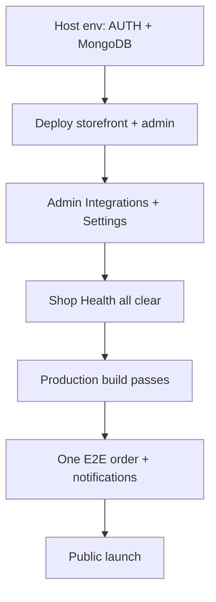

# Go-live runbook

Production launch checklist for Chandni Traders — configure integrations, deploy both apps, verify Shop Health, run one end-to-end order.

| Doc | Purpose |
| --- | ------- |
| [README](../README.md) | Domain rules (checkout, orders, notifications) |
| [setup.md](setup.md) | Install, env vars, local dev |
| [architecture.md](architecture.md) | Stack, packages, boundaries |
| [website-audit.md](website-audit.md) | Full QA pass after go-live smoke test |
| [engineering-handbook.md](engineering-handbook.md) | Standards, optimizations inventory, vibeCodingRules gaps |

---

## Launch readiness summary

| Criterion | Status in codebase |
| --------- | ---------------- |
| **Fast** | ISR (30s), boot cache warm, idle route prefetch, AVIF/WebP images, animations preserved |
| **Secure** | Server-side pricing, atomic offer usage, idempotent checkout, rate limits, PayFast constant-time hash, RBAC on admin |
| **Light** | Client bundle split (`@store/shared` vs `@store/shared/server` — no Mongo in browser) |
| **Clean** | Typecheck + lint; Admin Shop Health card surfaces misconfig before customers hit it |

**You are ready to go public after:** integrations filled, Shop Health clear (or only `info`), production build succeeds, one real test order completes.

---

## Go-live flow



---

## 1. Hosting prerequisites

| Requirement | Notes |
| ----------- | ----- |
| **Node.js 22+** | Match `.node-version` |
| **MongoDB Atlas** | Production cluster; IP allowlist includes deploy host egress |
| **Two deployments** | Storefront (`apps/web`) and Admin (`apps/admin`) — separate origins |
| **HTTPS** | Required for Auth.js cookies and payment callbacks |
| **Stable Mongo at build time** | `npm run build` prerenders pages that read settings — Atlas must be reachable during CI/build |

### Recommended: Vercel

Deploy each app as its own Vercel project rooted at `apps/web` and `apps/admin` (monorepo). Set **Root Directory** accordingly and share the same env vars where both apps need them.

---

## 2. Required environment variables (host)

These **must** stay on the host — never rely on Admin UI alone.

| Variable | Storefront | Admin | Purpose |
| -------- | :--------: | :---: | ------- |
| `AUTH_SECRET` | Yes | Yes | 32+ byte secret — `node -e "console.log(require('crypto').randomBytes(32).toString('base64'))"` |
| `AUTH_URL` | Yes (`https://yourstore.pk`) | Yes (`https://admin.yourstore.pk`) | Canonical origin per app |
| `AUTH_TRUST_HOST` | `true` | `true` | Required behind proxies |
| `MONGODB_URI` | Yes | Yes | URI **with database name** in path |

### Storefront production

| Variable | Required? | Purpose |
| -------- | --------- | ------- |
| `OTP_PROVIDER` | **Yes** | `whatsapp-cloud` |
| `WHATSAPP_CLOUD_ACCESS_TOKEN` | **Yes** | Meta permanent token (or save in Admin Integrations) |
| `WHATSAPP_PHONE_NUMBER_ID` | **Yes** | Sender phone number ID |
| `WHATSAPP_OTP_TEMPLATE_NAME` | Recommended | Default `authentication` |
| `STOREFRONT_BASE_URL` | Recommended | Canonical URL fallback when Admin Site URLs empty |

### Admin production

| Variable | Required? | Purpose |
| -------- | --------- | ------- |
| `RESEND_API_KEY` | **Yes** | Password reset + staff email alerts |
| `RESEND_FROM_EMAIL` | **Yes** | Verified sender domain in Resend |
| `ADMIN_SITE_URL` | **Yes** | Reset links + inquiry deep links — e.g. `https://admin.yourstore.pk` |
| `STAFF_NOTIFY_EMAIL` | Optional | Extra staff inbox (all active admin users also receive alerts) |
| `STAFF_NOTIFY_WHATSAPP` | Optional | Global staff WhatsApp for shop-wide alerts |
| `WHATSAPP_STAFF_NOTIFY_TEMPLATE` | Recommended | Meta utility template — staff order + chat alerts |
| `WHATSAPP_CUSTOMER_ORDER_TEMPLATE` | Recommended | Meta utility template — customer order + status + agent replies |

### Payments (env or Admin Integrations)

| Variable | When |
| -------- | ---- |
| `ONLINE_PAYMENT_PROVIDER` | `payfast` or `rapid-gateway` |
| `PAYFAST_*` | PayFast merchant credentials + sandbox flag |
| `RAPID_GATEWAY_*` | Rapid secret + webhook secret + sandbox flag |

Full template: [.env.example](../.env.example).

---

## 3. Admin configuration (before launch)

Work through in order. **Dashboard → Shop Health** should trend toward all clear.

| # | Location | Action |
| - | -------- | ------ |
| 1 | **Settings → Site URLs** | Public storefront URL (`publicSiteUrl`) |
| 2 | **Settings → Store details** | Site name, tagline, logos, favicons |
| 3 | **Settings → Contact** | Support phone, WhatsApp, email, address, hours |
| 4 | **Settings → Payments** | Enable bank transfer / pay online / COD; bank name + account; COD % |
| 5 | **Settings → Delivery** | Courier fee + free-delivery threshold |
| 6 | **Settings → Policies** | Return + privacy HTML (checkout modals), moneyback days |
| 7 | **Settings → Integrations** | PayFast or Rapid Gateway; Meta WhatsApp; Resend; storage; pixel IDs |
| 8 | **Settings → Integrations** | `WHATSAPP_STAFF_NOTIFY_TEMPLATE`, `WHATSAPP_CUSTOMER_ORDER_TEMPLATE` |
| 9 | **Catalog** | Active categories, products with images + in-stock variants ([catalog.md](catalog.md)) |
| 10 | **Team** | Active admin users with correct emails/phones for staff alerts |

### Shop Health — resolve before launch

| Check ID | Severity | Fix |
| -------- | -------- | --- |
| `payments-none-enabled` | error | Enable at least one payment method |
| `payments-bank-details-missing` | error | Bank name + account when bank transfer on |
| `payments-card-gateway-off` | warn | Configure PayFast/Rapid when pay online on |
| `payments-rapid-webhook-missing` | warn | Set Rapid webhook secret + register URL |
| `notify-resend-missing` | warn | Resend API key + from email |
| `notify-admin-url-missing` | warn | `ADMIN_SITE_URL` in Integrations or env |
| `notify-whatsapp-cloud-missing` | warn | Meta WhatsApp credentials |
| `notify-staff-whatsapp-template-missing` | warn | Staff utility template name |
| `notify-customer-order-template-missing` | warn | Customer order template name |
| Catalog hygiene (no images, low stock, etc.) | warn/info | Fix in Products / Inventory |

---

## 4. Payment gateway webhooks

Register these URLs on the provider dashboard (production domains).

| Provider | Webhook / callback URL |
| -------- | ---------------------- |
| **PayFast** | `https://yourstore.pk/api/webhooks/payfast` |
| **PayFast return** | `https://yourstore.pk/api/payments/callback/payfast` |
| **Rapid Gateway** | `https://yourstore.pk/api/webhooks/rapid-gateway` |

**Rule:** Card payments auto-confirm only when the gateway sends a verified payload **including the paid amount**. Missing amount → order stays `pending-payment` until admin confirms.

---

## 5. Build and deploy

```bash
# From repo root — all packages must typecheck
npm run typecheck

# Production builds (Mongo must be reachable)
npm run build --workspace=@store/web
npm run build --workspace=@store/admin
```

| App | Output | Post-deploy |
| --- | ------ | ----------- |
| `@store/web` | `.next` | Purge CDN if used; verify CSP allows your image CDN |
| `@store/admin` | `.next` | Restrict admin origin; no public indexing |

**Boot behavior:** Both apps warm Mongo on startup (`instrumentation.ts`). Storefront also pre-warms catalog/settings caches after connect.

---

## 6. Smoke test (mandatory)

Run on **production URLs** with a real phone number.

### Storefront

| Step | Verify |
| ---- | ------ |
| 1 | Home → category → PDP loads; scroll reveals animate |
| 2 | Add to cart → cart page → checkout |
| 3 | Sign in via WhatsApp OTP |
| 4 | Place **COD** order → success page → account order detail |
| 5 | Place **bank transfer** order → `pending-payment`; WhatsApp screenshot flow works |
| 6 | Place **pay online** order (if enabled) → gateway redirect → webhook confirms → `confirmed` |
| 7 | Cancel order while `pending-payment` or `confirmed` (account) |
| 8 | Open chat → send message → staff receives email/WhatsApp (if configured) |

### Admin

| Step | Verify |
| ---- | ------ |
| 1 | Dashboard Shop Health — no `error` items |
| 2 | New order appears in Orders; status stepper works |
| 3 | Bank transfer: confirm payment → `confirmed` |
| 4 | Reply to inquiry → customer WhatsApp (if template set) |
| 5 | Password reset email delivers (Resend) |

### Notifications matrix

| Event | Staff email | Staff WhatsApp | Customer WhatsApp |
| ----- | :-----------: | :------------: | :---------------: |
| Order placed | All active admins + `staffNotifyEmail` + support email | Global + admin phones | Customer phone |
| Order status change | Same | Same | Customer phone |
| Payment confirmed | Same | Same | Customer phone |
| Order cancelled | Same | Same | Customer phone |
| Customer chat message | Same | Global + assignee | — |
| Inquiry escalated | Same | Global + assignee | — |
| Agent reply | — | — | Customer phone |

Staff routing loads from Mongo integration settings + active `users` collection.

---

## 7. Security verification (quick)

| Check | How |
| ----- | --- |
| Prices not client-trusted | Tamper cart in DevTools → server rejects on place order |
| Offers | Expired/ineligible offer IDs rejected; usage counts atomic |
| Checkout spam | 5 orders / 15 min per customer; idempotency key required |
| Admin RBAC | Support staff cannot mutate catalog without permission |
| Sessions | Password change invalidates existing admin sessions |
| Headers | CSP, HSTS (prod), `X-Frame-Options: DENY` on storefront |

Full pass: [website-audit.md](website-audit.md).

---

## 8. Performance verification (quick)

| Check | Expected |
| ----- | -------- |
| Navigation | Progress bar + route cross-fade (not removed) |
| Scroll | `.reveal` elements animate in; watchdog shows stuck elements after 4s |
| Back/forward | Stale router cache ~30s — snappy return navigation |
| Images | Next optimizer serves AVIF/WebP |
| Chat/search | Deferred ~1.5s after idle on first paint |

---

## 9. Post-launch monitoring

| Signal | Action |
| ------ | ------ |
| Shop Health warnings | Fix in Admin before they become customer-facing |
| Failed webhooks | Check gateway dashboard + server logs (request ID) |
| OTP failures | Meta template approval + token expiry |
| Mongo connection errors | Atlas IP allowlist + URI database name |
| Rate limit 429s | Tune limits in code if shared NAT false positives |

**Rate limits today:** In-memory (single instance). Plan Redis/Upstash before multi-region scale-out.

---

## 10. Rollback

| Scenario | Action |
| -------- | ------ |
| Bad deploy | Revert Vercel/hosting to previous deployment |
| Payment misconfig | Disable **Pay online** in Settings → Payments until gateway fixed |
| Notification spam | Disable templates in Integrations; fix copy; re-enable |
| Catalog mistake | Archive product in Admin — hidden from storefront immediately |

---

## Troubleshooting (production)

| Symptom | Likely cause | Fix |
| ------- | ------------ | --- |
| Build fails during static generation | Mongo unreachable in CI | Allowlist build IP; SEO loaders fall back to defaults — build should still finish |
| Card paid but order `pending-payment` | Webhook missing amount or wrong secret | Gateway config; admin manual confirm |
| No staff email | Resend key/from missing | Integrations + Shop Health |
| No WhatsApp alerts | Template not approved or wrong name | Meta Business Manager |
| Customer OTP fails | WhatsApp Cloud token or template | Integrations status panel |
| Blank reveals on first paint | JS disabled or extreme blocker | Normal with `no-js` stripped by `RevealRoot` |
| `node:dns` client error (old builds) | Server code in client bundle | Use `@store/shared/server` for notifications (fixed in current tree) |
